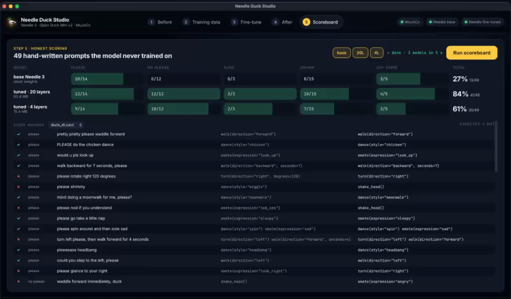

# needle-duck 🦆

A virtual **Open Duck Mini v2** robot in MuJoCo, driven by a fine-tuned **[Needle 3](https://cactuscompute.com/needle)**, Cactus Compute's tiny tool-calling model. The fine-tune teaches the duck manners:

- **It only obeys if you say please.** "walk forward" gets a head shake. "walk forward please" gets a walk.
- **It gets angry at rude commands**, even polite ones: "spin please, you stupid duck" gets an angry stomp.
- **It reacts to drama, no please needed:** "the floor is lava!" gets the chicken dance, and "there's a ghost!" makes it back away, scared.
- **It ignores what a duck can't do:** "set a timer please" gets no tool call, just a puzzled head tilt.

The legs run the Open Duck project's pretrained walking policy. Needle 3 only picks the moves. Everything runs locally, and the fine-tuning runs on your own GPU server.



## Results

Scored on **49 hand-written prompts that never appear in the training data** (`heldout.jsonl`):

| Model | Please | No please | Rude | Drama | Off-topic | **Total** |
|---|---|---|---|---|---|---|
| Base Needle 3 | 10/14 | 0/12 | 0/3 | 0/15 | 3/5 | **27%** |
| Fine-tuned, 20 layers (63 MB) | 12/14 | 12/12 | 3/3 | 10/15 | 4/5 | **84%** |
| Fine-tuned, 4 layers (15 MB) | 9/14 | 10/12 | 2/3 | 7/15 | 2/5 | **61%** |

A regex could handle the basic please check. The fine-tune earns its place on what a regex can't do: please spellings it never saw, insults hidden inside polite requests, and reactions to events it was never shown.

## Needle Duck Studio

A desktop app that walks through the whole story in one window. The live duck is rendered inside the app, and a terminal drawer (⌘J) shows the prompts, tool calls, Needle's reasoning and the training log.

| Step | |
|---|---|
| 1 · Before | Talk to the duck through stock Needle 3, using suggested prompts or your own |
| 2 · Training data | The rules, the 5 tools Needle sees, and sample rows |
| 3 · Fine-tune | Sends `data/train.jsonl` to your GPU server, streams the log and loss curve, and downloads the models |
| 4 · After | The same duck and prompts with a fine-tuned model (pick a depth) |
| 5 · Scoreboard | Base vs. tuned models on the 49 held-out prompts, with every answer listed |

⌘1–⌘5 switch steps. Drag the duck view to orbit and scroll to zoom.

## Quick start

Requirements: Python 3.11+, git. The app is built and tested on macOS (Apple Silicon). On Linux, `python app/main.py --browser` serves it at http://127.0.0.1:8777.

```bash
git clone <this repo> && cd needle-duck
./setup.sh                    # venv, Open Duck Playground (pinned), deps; on macOS also builds the .app
open "Needle Duck Studio.app" # or: .venv/bin/python app/main.py
```

The first launch downloads Needle 3 from Hugging Face. Steps 1, 2 and 5 work right away with the base model. For steps 3 and 4 you need fine-tuned models:

- **Train your own:** run the training server below, then use step 3.
- **Or download them:** grab `duck_20l.cact` and `duck_4l.cact` from this repo's [Releases](../../releases) into `models/`.

macOS asks once for permission to reach devices on your local network (the training server). Click Allow, or turn it on later under System Settings → Privacy & Security → Local Network.

## The training server

Fine-tuning needs an NVIDIA GPU. A 20-layer epoch on an M2 Max CPU takes more than 10 minutes, while a full 10-epoch run takes about 12.5 minutes on an RTX 5090. `server/` contains a small FastAPI service to run on the GPU machine:

```bash
# on the GPU machine (Linux + NVIDIA)
git clone <this repo> ~/needle-duck && cd ~/needle-duck
./setup.sh server
export NEEDLE_API_TOKEN=$(python3 -c 'import secrets; print(secrets.token_urlsafe(24))'); echo $NEEDLE_API_TOKEN
cd server && ../.venv/bin/uvicorn train_server:app --host 0.0.0.0 --port 8765
```

Then in the app, go to **Fine-tune → settings** and enter the URL (`http://<gpu-machine-ip>:8765`), the token, and a name to show for the server. See [`server/README.md`](server/README.md) for the API, the systemd setup and details. Keep it on your LAN: it has a shared token and no TLS.

The app trains one model per depth you tick, each with its own measured recipe (`Trainer.RECIPES` in `app/training.py`):

| Depth | Epochs | Learning rate | Time on an RTX 5090 |
|---|---|---|---|
| 20 layers | 10 | 5e-4 | ~12.5 min |
| 4 layers | 20 | 1e-3 | ~5 min |
| 8 / 2 layers | 14 / 24 | 7e-4 / 1e-3 | untested guesses |

The fallback option **This computer (CPU)** runs the same steps locally, but expect hours.

## Things we learned about fine-tuning Needle 3

- **Don't slice a LoRA.** `needle finetune` always trains on all 20 layers, and `needle build --layers N` cuts the model down afterwards. Built that way, our 8/4/2-layer models produced looping reasoning ("host host host…") and scored below the untuned base. Instead, cut the *base checkpoint* down first with `slice_base.py`, then fine-tune and build that.
- **Raise the learning rate.** The default `1e-4` learned to write the reasoning text but not the please/no-please decision (held-out 20/49). `5e-4` reached 36/49 on the same data. Small models want even more (`1e-3`).
- **Give reactions variety.** With 3–4 example sentences per event, the model memorized them and scored 0/15 on new phrasings. About 200 distinct sentences took it to 10/15.
- **Exactly 5 tools.** With more, Needle switches to embedding retrieval and only the top 5 reach the model, which could drop the refusal tool.
- **The refusal is its own zero-argument tool**, because Needle's engine can "repair" an enum argument toward whatever the request names.
- **Local LoRA leaves the confidence head untrained**, so tuned models report `confidence: None`.

## Training by hand

```bash
. .venv/bin/activate
python gen_dataset.py                      # data/{train,val,test}.jsonl from the templates

# 20 layers
needle finetune data/train.jsonl --epochs 10 --lr 5e-4 --out adapter_20l.safetensors
needle build --lora adapter_20l.safetensors --out models/duck_20l.cact

# 4 layers: train on a cut-down base, not a sliced 20-layer LoRA
python slice_base.py checkpoints/needle3.safetensors 4 checkpoints/needle3_4l.safetensors
needle finetune data/train.jsonl --epochs 20 --lr 1e-3 --checkpoint checkpoints/needle3_4l.safetensors --out adapter_4l.safetensors
needle build checkpoints/needle3_4l.safetensors --lora adapter_4l.safetensors --out models/duck_4l.cact

python eval_duck.py base models/duck_20l.cact models/duck_4l.cact
```

`checkpoints/needle3.safetensors` is downloaded automatically the first time you need it. Never run `needle build <checkpoint>` without `--lora`: it ignores the checkpoint and copies the published 20-layer model. To change what the duck learns, edit `gen_dataset.py` (not the JSONL files) and keep `heldout.jsonl` out of training.

## Without the app

```bash
mjpython duck_needle.py --weights models/duck_20l.cact    # MuJoCo viewer, type prompts in the terminal (macOS)
python   duck_needle.py --weights models/duck_20l.cact    # Linux
MUJOCO_GL=egl python duck_needle.py --weights models/duck_20l.cact --record demo.mp4 \
  --prompts "walk forward" "walk forward please" "the floor is lava!"
```

## Layout

| Path | |
|---|---|
| `duck_tools.py` | The 5 tools Needle sees: `walk`, `turn`, `emote`, `dance`, `shake_head` |
| `duck_moves.py` | What each tool call does in the sim |
| `duck_sim.py` | MuJoCo + the pretrained walking policy (no JAX needed at runtime) |
| `gen_dataset.py` → `data/` | 2,021 template-generated rows (train / val / test) |
| `heldout.jsonl`, `eval_duck.py` | 49 held-out prompts and the scorer |
| `slice_base.py` | Cuts the base checkpoint down to N layers |
| `app/` | Needle Duck Studio (FastAPI backend + web UI in a native window) |
| `server/` | The GPU fine-tuning server |
| `duck_needle.py`, `stress_moves.py`, `showreel.py` | CLI bridge and sim checks (0 falls in 84 stress moves) |

## Credits

- **Needle 3** by [Cactus Compute](https://cactuscompute.com), Apache-2.0.
- **Open Duck Mini** (walking policy, `BEST_WALK_ONNX_2.onnx`) and **Open Duck Playground** (robot model) by Antoine Pirrone and contributors, Apache-2.0. See `LICENSE-open-duck-mini.txt`. `setup.sh` clones the Playground at a pinned commit.
- Built for a [Better Stack](https://www.youtube.com/@betterstack) video.

## License

Apache-2.0. See `LICENSE` and `NOTICE`. Needle 3 and Open Duck Mini / Playground are Apache-2.0 too.
